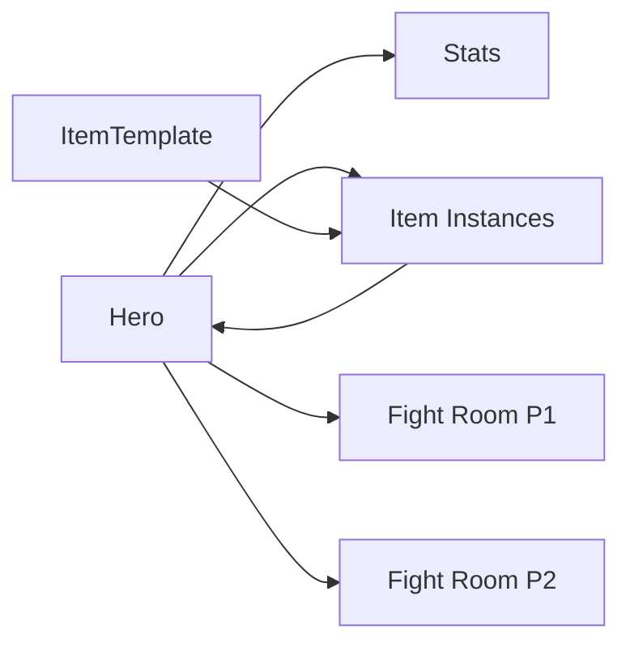

# Project Context: FightMe Backend

## 🎯 Project Overview

**FightMe Backend** is a real-time multiplayer fighting/RPG game backend built
with **Bun** runtime, **TypeScript**, **Drizzle ORM**, and **PostgreSQL**. The
system supports hero management, PvP/PvE combat, item systems, and real-time
WebSocket communication.

## 🏗️ Architecture Pattern

### **Runtime & Framework**

- **Bun**: Primary runtime for server, WebSocket handling, and package
  management
- **TypeScript**: Full type safety across the codebase
- **Native WebSocket**: Direct Bun WebSocket implementation (no Socket.io for
  WebSocket)

### **Database Layer**

- **PostgreSQL**: Primary database (via Neon serverless)
- **Drizzle ORM**: Type-safe database operations and schema management
- **Schema-first approach**: Database schemas define TypeScript types

## 📁 Project Structure

```
fightMeBackend/
├── drizzle/                     # Database layer
│   ├── db.ts                   # Database connection & schema imports
│   ├── migrations/             # Auto-generated migrations
│   ├── queries/                # Database query functions
│   │   ├── hero.ts            # Hero CRUD operations
│   │   └── item.ts            # Item CRUD operations
│   └── schema/                 # Database schemas
│       ├── hero.ts            # Hero, stats tables & relations
│       ├── fightRoom.ts       # Fight room schema
│       └── item.ts            # Item template & instance schemas
├── rest_routes/                # HTTP REST endpoints
├── socket_helpers/             # WebSocket message handling
│   ├── message_routes/        # Individual WebSocket message handlers
│   ├── socketCache.ts         # In-memory caching (Maps)
│   ├── socketRouter.ts        # WebSocket message routing
│   └── socketTopics.ts        # Pub/sub topics
├── helpers/                    # Business logic utilities
├── types/                      # TypeScript type definitions
├── constants/                  # Application constants
└── server.ts                   # Main server configuration
```

## 🎮 Core Domain Models

### **Hero System**

```typescript
// Core entities
heroSxma: {
  id: string (PK)
  nickname: string (unique)
  lvl: number (default: 1)
  type: "hero" | "bot"
  exp: number
  statsPoints: number
  isDupe: boolean // for bot copies
}

statsSxma: {
  ownerId: string (FK -> heroSxma.id)
  strength, mastery, agility, health, knowledge: number (default: 5)
  currentHp: number
}
```

### **Item System (Template + Instance Pattern)**

```typescript
// Shared item templates
itemTemplateSxma: {
  id: number (PK)
  name, type, rarity: string
  baseStats: jsonb // { damage: 10, ... }
  requirements: jsonb // { level: 15, strength: 20 }
  price: number
}

// Per-user item instances
itemInstanceSxma: {
  templateId: number (FK -> itemTemplateSxma.id)
  ownerId: string (FK -> heroSxma.id)
  equipped: boolean
  equipSlot: number // 1-6 slots
}
```

### **Fight Room System**

```typescript
// In-memory fight rooms
RoomType: {
  players: Player[]
  rounds: Round[]
  isPvp: boolean
  status: "waiting" | "active" | "finished"
  matchResult?: { winnerId, exp, ... }
}
```

## 🔧 Technical Patterns

### **Database Patterns**

1. **Schema-first Design**: Drizzle schemas generate TypeScript types
2. **Relational Integrity**: Foreign keys with cascade deletes
3. **Type Inference**: `typeof table.$inferSelect/Insert` for type safety
4. **Transaction Support**: Critical operations wrapped in `db.transaction()`

### **Caching Strategy**

```typescript
// In-memory Maps for performance
activeHeroesCache: Map<heroId, ActiveHeroesType>;
fightRoomsCache: Map<roomId, RoomType>;
userRoomsCache: Map<heroId, UserRoomType>;
userSockets: Map<heroId, WebSocket>;
```

### **WebSocket Message Pattern**

```typescript
// Centralized message routing
messageRouter(server, ws, message) {
  const { type, ...rest } = message;
  switch(type) {
    case "createRoom": return createRoomRoute(server, ws, rest);
    case "activeHeroes": return activeHeroesRoute(server, ws, rest);
    // ... other routes
  }
}
```

### **REST API Pattern**

```typescript
// Consistent endpoint structure
export const routeFunction = async (req: BunRequest<"/path/:param">) => {
  try {
    const { param } = req.params;
    const result = await queryFunction(param);
    return Response.json(result, { status: 200 });
  } catch (err) {
    return Response.json({ message: "ERROR: ..." }, { status: 500 });
  }
};
```

## 🎯 Game Mechanics

### **Stats Calculation System**

Located in `helpers/calculateStatsHelper.ts`:

- **Primary Stats**: strength, mastery, agility, health, knowledge
- **Derived Stats**: HP, damage, crit chance, evasion, etc.
- **Formulas**: Mathematical formulas for stat scaling
- **Gear Integration**: Future support for item stat bonuses

### **Combat System**

- **Turn-based**: Players submit actions simultaneously
- **Action Types**: attack area/time, block area/time
- **Combat Resolution**: Damage calculation with crits, blocks, evasion
- **PvP & PvE**: Support for both player vs player and bot fights

### **Bot System**

- **Template Bots**: Original bot definitions
- **Fight Copies**: Temporary bot copies created per fight
- **Copy Pattern**: `botId + "-" + roomId` for unique instances

## 📦 Dependencies & Tools

### **Core Dependencies**

```json
{
  "drizzle-orm": "^0.41.0", // Type-safe ORM
  "postgres": "^3.4.5", // PostgreSQL driver
  "@neondatabase/serverless": "^1.0.0", // Neon DB connection
  "drizzle-kit": "^0.30.6", // Schema management & migrations
  "ws": "^8.18.3" // WebSocket support
}
```

### **Development Scripts**

```json
{
  "start": "bun --hot run server.ts", // Hot reload server
  "dbgen": "drizzle-kit generate", // Generate migrations
  "dbmig": "drizzle-kit migrate" // Run migrations
}
```

## 🔌 API Endpoints

### **HTTP REST Routes**

```
POST /user/registerHero/:heroName     # Create new hero
GET  /user/getHero/:heroId           # Get hero with stats & items
POST /user/updateHeroStats           # Update hero stats
POST /fight/createRoom/:heroId       # Create PvP room
POST /fight/createBotRoom/:heroId/:botId # Create PvE room
POST /fight/joinRoom/:heroId/:roomId # Join existing room
POST /misc/createBot/:heroName       # Create bot template
GET  /misc/getAllBots                # Get all bot templates
POST /misc/createItem                # Create item template
GET  /shop/getItems                  # Get all shop items
```

### **WebSocket Message Types**

```
createRoom, joinRoom, createBotRoom  # Room management
activeRooms, activeHeroes           # State queries
submitRound                         # Combat actions
currentHp                          # Health queries
```

## 🗄️ Data Relations



## 🎮 Game Flow

1. **Hero Creation**: POST `/user/registerHero/:name` → Creates hero + default
   stats
2. **Hero Authentication**: WebSocket connection with `?heroId=...`
3. **Room Creation**: WebSocket `{type: "createRoom"}` or REST endpoint
4. **Combat**: WebSocket `{type: "submitRound", selected: {attack, block}}`
5. **Real-time Updates**: Server publishes to subscribed clients

## 🚨 Important Notes

### **Naming Conventions**

- **Tables**: `*Sxma` suffix (e.g., `heroSxma`, `statsSxma`)
- **Functions**: camelCase with descriptive names
- **Types**: PascalCase with `Type` suffix
- **Constants**: UPPER_SNAKE_CASE

### **Performance Considerations**

- **In-memory caching** for active sessions
- **Database transactions** for data consistency
- **WebSocket pub/sub** for real-time updates
- **Query optimization** with Drizzle relations

### **Future Improvements**

- **Shared calculation engine**: NPM package for client/server sync
- **Equipment system expansion**: Durability, enchanting, sockets
- **Health regen optimization**: Replace expensive daemon with rest timers
- **Authentication**: JWT tokens instead of heroId in URL

## 🔄 Development Workflow

1. **Schema Changes**: Update `drizzle/schema/*.ts`
2. **Generate Migration**: `bun dbgen`
3. **Apply Migration**: `bun dbmig`
4. **Update Queries**: Modify `drizzle/queries/*.ts`
5. **Add Routes**: Create new files in `rest_routes/` or
   `socket_helpers/message_routes/`
6. **Test**: `bun start` with hot reload

This context should provide comprehensive understanding of the project
structure, patterns, and conventions for all future development requests.
